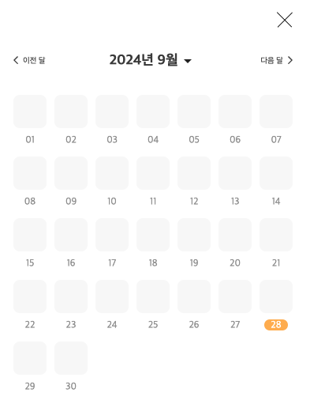
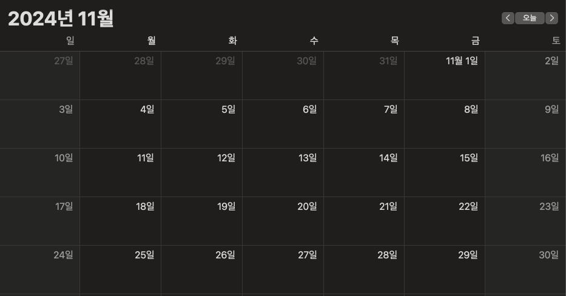

# react-custom-calendars

It provides calendar data that you can customize and use as you wish. (in React)




## Installation

### npm

```
npm i react-custom-calendars --save
```

### yarn

```
yarn add react-custom-calendars
```

## Example

```typescript
import { MonthCalendar } from "react-custom-calendars";

function App() {
  const { MonthCalendarData } = MonthCalendar("dd");

  return (
    <main>
      {MonthCalendarData.map((weeks) => (
        <li
          style={{
            listStyle: "none",
            display: "flex",
            gap: "10px",
          }}
        >
          {weeks.map((date) => (
            <p style={{ width: "20px" }}>{date}</p>
          ))}
        </li>
      ))}
    </main>
  );
}

export default App;
```

## MonthCalendar

- You can return date data in calendar format.
- example

```typescript
const { currentDate, setCurrentDate, MonthCalendarData } = MonthCalendar("dd");
```

### Argument

| name        | required |   type   | Description                                                                            | Example                    |
| ----------- | :------: | :------: | -------------------------------------------------------------------------------------- | -------------------------- |
| format      |    O     | `string` | Format of returned date                                                                | `dd`, `d`, `yyyy-MM-dd`... |
| currentDate |    X     |  `Date`  | Standard for date data to be returned (if there is no value, today's date is returned) | `new Date(2024, 8, 15)`    |

### Return

| name              |    type    | Description                                                                                              |
| ----------------- | :--------: | -------------------------------------------------------------------------------------------------------- |
| currentDate       |  `string`  | Standard for date data to be returned                                                                    |
| setCurrentDate    | `function` | A function that changes the currentDate, which is the reference point of the monthly date to be returned |
| MonthCalendarData | `string[]` | Data that can be displayed on a calendar based on currentDate                                            |
